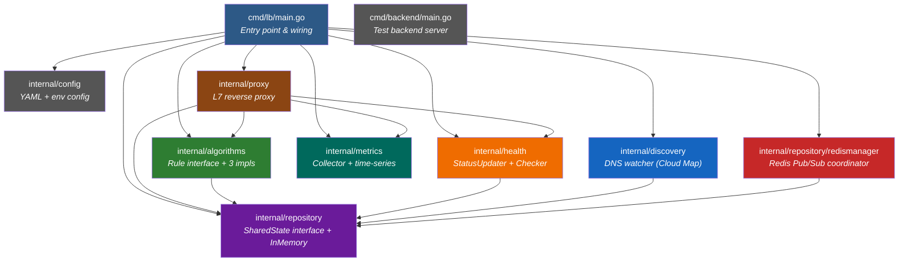
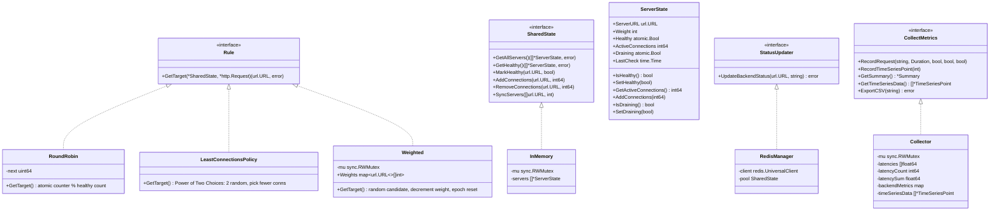
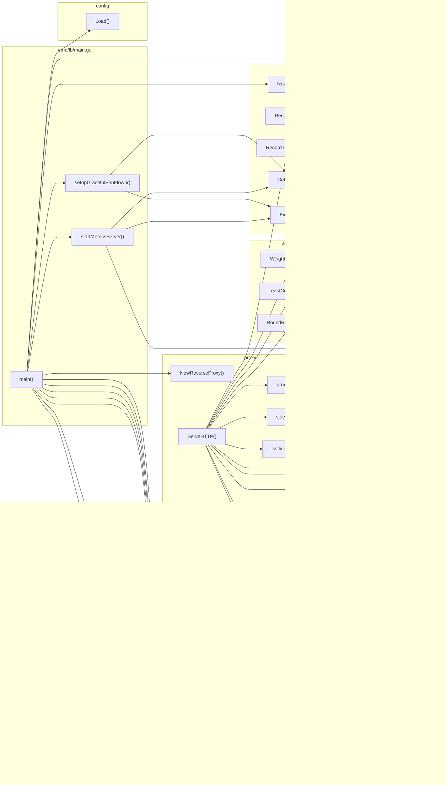

# Codemap — HA-L7-LB

A visual and textual map of every package, exported function, cross-package call, goroutine, and synchronization primitive in the codebase.

---

## Package Dependency Graph



---

## Interface Implementations



---

## Cross-Package Call Graph

This traces every cross-package function call in the codebase.



---

## Goroutine Spawn Map

All goroutine launch points and their lifetimes.

```mermaid
gantt
    title Background Goroutines (Lifetime of Process)
    dateFormat X
    axisFormat %s

    section Startup (main.go)
    DNS Discovery Watcher          :active, dns, 0, 100
    Redis Periodic Sync            :active, rsync, 0, 100
    Redis Pub/Sub Watcher          :active, rwatch, 0, 100
    Health Checker                 :active, hc, 0, 100
    Metrics HTTP Server            :active, mhttp, 0, 100
    Time-Series Recorder           :active, ts, 0, 100
    Signal Handler                 :active, sig, 0, 100

    section Per-Request (proxy.go)
    Fire-and-forget Redis Update   :crit, redis_ff, 50, 51
```



| Spawn Location | Purpose | Lifetime |
|----------------|---------|----------|
| `discovery.StartDNSWatcher()` | Poll DNS every 5s, call `pool.SyncServers()` | Process lifetime |
| `redismanager.StartPeriodicSync()` | Re-sync from Redis every N seconds | Process lifetime |
| `redismanager.StartRedisWatcher()` | Subscribe to `lb-backend-events` Pub/Sub channel | Process lifetime |
| `health.Checker.Start()` | Run `checkAll()` every health check interval | Process lifetime |
| `main.startMetricsServer()` | Serve `/metrics`, `/health/backends` on port+1000 | Process lifetime |
| `main.go` time-series goroutine | Call `collector.RecordTimeSeriesPoint()` every 5s | Process lifetime |
| `main.setupGracefulShutdown()` | Listen for SIGINT/SIGTERM, drain via `server.Shutdown(10s)`, dump metrics, exit | Process lifetime |
| `health.checkAll()` → per-backend | One goroutine per backend per health check cycle | Short-lived |
| `proxy.ServeHTTP()` → Redis update | Fire-and-forget `updater.UpdateBackendStatus()` on failure | Short-lived |

---

## Synchronization Primitives

### Atomic Operations (Lock-Free Hot Path)

| Type | Field | Location | Used By |
|------|-------|----------|---------|
| `atomic.Bool` | `ServerState.Healthy` | `repository/models.go:18` | Health checker, proxy, algorithms, metrics server |
| `atomic.Int64` | `ServerState.ActiveConnections` | `repository/models.go:20` | Proxy (add/remove), LeastConnections algorithm |
| `atomic.Bool` | `ServerState.Draining` | `repository/models.go:21` | SyncServers (connection draining on DNS removal) |
| `atomic.Uint64` | `RoundRobin.next` | `algorithms/RoundRobin.go:15` | RoundRobin.GetTarget() |
| `int64` (atomic ops) | `ReverseProxy.activeRequests` | `proxy/proxy.go:56` | ServeHTTP (retry budget denominator) |
| `int64` (atomic ops) | `ReverseProxy.activeRetries` | `proxy/proxy.go:57` | ServeHTTP (retry budget numerator) |

### Mutexes

| Type | Field | Location | Protects |
|------|-------|----------|----------|
| `sync.RWMutex` | `InMemory.mu` | `repository/in_memory.go:19` | `servers []*ServerState` slice |
| `sync.RWMutex` | `Weighted.mu` | `algorithms/Weighted.go:39` | `Weights map[url.URL][]int` |
| `sync.RWMutex` | `Collector.mu` | `metrics/collector.go:26` | All metrics counters, latencies, time-series |
| `sync.Once` | `config.once` | `config/config.go:63` | Single config load |

### Lock Patterns

```
Read-heavy path (proxy request routing):
  RoundRobin.GetTarget()  → atomic only (no lock)
  LeastConn.GetTarget()   → atomic reads only (no lock), Power of Two Choices
  InMemory.GetHealthy()   → RLock (concurrent readers OK)

Write path (state updates):
  InMemory.MarkHealthy()      → Lock (exclusive)
  InMemory.Add/RemoveConns()  → Lock (exclusive)
  InMemory.SyncServers()      → Lock (exclusive)
  Collector.RecordRequest()   → Lock (exclusive)
  Weighted.GetTarget()        → Lock (exclusive, modifies weights)
```

---

## Exported Functions by File

### cmd/lb/main.go
| Function | Line | Signature |
|----------|------|-----------|
| `main()` | 57 | `func main()` — creates `*http.Server` explicitly, passes `config.AppConfig.LoadBalancer.Timeout` to `NewReverseProxy` |
| `startMetricsServer()` | 184 | `func startMetricsServer(collector *metrics.Collector, pool repository.SharedState, port int)` |
| `setupGracefulShutdown()` | 246 | `func setupGracefulShutdown(collector *metrics.Collector, outputFile string, server *http.Server)` |

### cmd/backend/main.go
| Function | Line | Signature |
|----------|------|-----------|
| `main()` | 40 | `func main()` |
| `getLocalIP()` | 96 | `func getLocalIP() string` |

### internal/proxy/proxy.go
| Function/Type | Line | Signature |
|---------------|------|-----------|
| `maxBodySize` | 44 | `const maxBodySize = 10 << 20` |
| `retryBudgetPct` | 45 | `const retryBudgetPct = 0.20` |
| `ReverseProxy` | 49 | `struct { pool, algo, collector, updater, transport, timeout time.Duration, activeRequests int64, activeRetries int64 }` |
| `NewReverseProxy()` | 61 | `func NewReverseProxy(pool, algorithm, collector, updater, timeout time.Duration) *ReverseProxy` |
| `ServeHTTP()` | 82 | `func (lb *ReverseProxy) ServeHTTP(w, r)` |
| `proxyRequest()` | 230 | `func (lb *ReverseProxy) proxyRequest(w, r, destURL) error` |
| `selectDifferent()` | 280 | `func (lb *ReverseProxy) selectDifferent(backends, exclude, req) *url.URL` |
| `isIdempotent()` | 307 | `func isIdempotent(method string) bool` |
| `isClientDisconnect()` | 314 | `func isClientDisconnect(err error) bool` |
| `BackendError` | 329 | `struct { URL string, StatusCode int }` with `Error() string` |
| `TimeoutError` | 324 | `struct { URL string }` with `Error() string` |
| `copyHeaders()` | 343 | `func copyHeaders(dst, src http.Header)` |

### internal/algorithms/RoundRobin.go
| Function | Line | Signature |
|----------|------|-----------|
| `GetTarget()` | 20 | `func (r *RoundRobin) GetTarget(state, req) (url.URL, error)` |

### internal/algorithms/LeastConnections.go
| Function | Line | Signature |
|----------|------|-----------|
| `GetTarget()` | 26 | `func (lc *LeastConnectionsPolicy) GetTarget(state, req) (url.URL, error)` — Power of Two Choices: picks 2 random backends, returns one with fewer connections |

### internal/algorithms/Weighted.go
| Function | Line | Signature |
|----------|------|-----------|
| `GetTarget()` | 44 | `func (wrr *Weighted) GetTarget(state, req) (url.URL, error)` |

### internal/repository/models.go
| Function | Line | Signature |
|----------|------|-----------|
| `IsHealthy()` | 25 | `func (s *ServerState) IsHealthy() bool` |
| `SetHealthy()` | 30 | `func (s *ServerState) SetHealthy(healthy bool)` |
| `GetActiveConnections()` | 37 | `func (s *ServerState) GetActiveConnections() int64` |
| `AddConnections()` | 45 | `func (s *ServerState) AddConnections(connections int64)` |
| `IsDraining()` | 51 | `func (s *ServerState) IsDraining() bool` |
| `SetDraining()` | 57 | `func (s *ServerState) SetDraining(draining bool)` |

### internal/repository/in_memory.go
| Function | Line | Signature |
|----------|------|-----------|
| `NewInMemory()` | 26 | `func NewInMemory(servers []url.URL, weights []int) *InMemory` |
| `GetAllServers()` | 46 | `func (i *InMemory) GetAllServers() ([]*ServerState, error)` |
| `GetHealthy()` | 59 | `func (i *InMemory) GetHealthy() ([]*ServerState, error)` |
| `MarkHealthy()` | 77 | `func (i *InMemory) MarkHealthy(serverURL url.URL, healthy bool)` |
| `AddConnections()` | 93 | `func (i *InMemory) AddConnections(serverURL url.URL, connections int64)` |
| `RemoveConnections()` | 106 | `func (i *InMemory) RemoveConnections(serverURL url.URL, connections int64)` |
| `SyncServers()` | 119 | `func (i *InMemory) SyncServers(activeURLs []url.URL, defaultWeight int)` — clears Draining on existing; drains (not drops) removed backends with active connections |

### internal/repository/redismanager/redis.go
| Function | Line | Signature |
|----------|------|-----------|
| `NewRedisManager()` | 58 | `func NewRedisManager(addr, password string, db int, pool SharedState) (*RedisManager, error)` |
| `UpdateBackendStatus()` | 100 | `func (rm *RedisManager) UpdateBackendStatus(backendURL url.URL, status string) error` |
| `SyncOnStartUp()` | 128 | `func (rm *RedisManager) SyncOnStartUp()` |
| `StartPeriodicSync()` | 163 | `func (rm *RedisManager) StartPeriodicSync(ctx context.Context, interval time.Duration)` |
| `StartRedisWatcher()` | 188 | `func (rm *RedisManager) StartRedisWatcher()` |
| `Close()` | 220 | `func (rm *RedisManager) Close() error` |

### internal/health/checker.go
| Function | Line | Signature |
|----------|------|-----------|
| `NewChecker()` | 31 | `func NewChecker(pool *InMemory, updater StatusUpdater, interval, timeout time.Duration) *Checker` |
| `Start()` | 51 | `func (hc *Checker) Start()` |
| `checkAll()` | 66 | `func (hc *Checker) checkAll()` |
| `checkBackend()` | 80 | `func (hc *Checker) checkBackend(backend *ServerState)` |

### internal/metrics/collector.go
| Function/Const | Line | Signature |
|----------------|------|-----------|
| `maxLatencySamples` | 24 | `const maxLatencySamples = 10000` |
| `NewCollector()` | 98 | `func NewCollector(policyName string) *Collector` |
| `RecordRequest()` | 111 | `func (c *Collector) RecordRequest(backend string, latency Duration, success, timeout, retried bool)` — uses reservoir sampling when latencies slice is full |
| `RecordTimeSeriesPoint()` | 162 | `func (c *Collector) RecordTimeSeriesPoint(activeBackends int)` — uses `latencySum`/`latencyCount` for exact averages |
| `GetSummary()` | 186 | `func (c *Collector) GetSummary() *Summary` — uses `latencySum`/`latencyCount` for exact average |
| `GetTimeSeriesData()` | 241 | `func (c *Collector) GetTimeSeriesData() []*TimeSeriesPoint` |
| `ExportCSV()` | 252 | `func (c *Collector) ExportCSV(filepath string) error` |

### internal/config/config.go
| Function | Line | Signature |
|----------|------|-----------|
| `Load()` | 68 | `func Load(configPath string)` |

### internal/discovery/dns.go
| Function | Line | Signature |
|----------|------|-----------|
| `StartDNSWatcher()` | 18 | `func StartDNSWatcher(ctx, hostname, port, scheme string, defaultWeight int, pool SharedState)` |
| `syncDNS()` | 39 | `func syncDNS(hostname, port, scheme string, defaultWeight int, pool SharedState)` |

---

## Data Flow: Request Happy Path

```
HTTP Request arrives at ReverseProxy.ServeHTTP()
    │
    │  io.ReadAll(r.Body) ──► bodyBytes buffer (for retry replay)
    │
    ├─ pool.GetHealthy()
    │      │ RLock → filter servers where IsHealthy()==true → RUnlock
    │      └─► []*ServerState (healthy backends)
    │
    ├─ algo.GetTarget(pool, r)
    │      │ RoundRobin:  atomic.AddUint64(&next,1) % len(healthy)
    │      │ LeastConn:   Power of Two Choices: pick 2 random, compare conns, return winner
    │      │ Weighted:    Lock, rand candidate, decrement weight, Unlock
    │      └─► url.URL (selected backend)
    │
    ├─ pool.AddConnections(url, 1)
    │      │ Lock → find server → atomic.AddInt64(&ActiveConnections, 1) → Unlock
    │
    ├─ proxyRequest(w, r, url)
    │      │ context.WithTimeout(lb.timeout)
    │      │ rewrite r.URL.Scheme, r.URL.Host
    │      │ transport.RoundTrip(r)
    │      │ copyHeaders(w, resp)
    │      │ io.Copy(w, resp.Body)
    │      └─► nil (success) or error (timeout/connection failure)
    │
    ├─ pool.RemoveConnections(url, 1)
    │      │ Lock → find server → atomic.AddInt64(&ActiveConnections, -1) → Unlock
    │
    └─ collector.RecordRequest(url, latency, true, false, false)
           │ Lock → totalRequests++, successfulRequests++, latencySum += ms,
           │ latencyCount++, reservoir sampling if latencies full → Unlock
```

## Data Flow: Retry Path (Idempotent Failure)

```
proxyRequest() returns error AND isIdempotent(r.Method)==true
    │
    ├─ pool.MarkHealthy(failedURL, false)
    │      │ Lock → find server → SetHealthy(false) → Unlock
    │
    ├─ go func() { updater.UpdateBackendStatus(failedURL, "DOWN") }()
    │      │ (fire-and-forget goroutine)
    │      │ redis.Set("backend:"+url, "DOWN")
    │      │ redis.Publish("lb-backend-events", url+"|DOWN")
    │
    ├─ pool.GetHealthy()  ──► fresh snapshot (excludes just-marked-down backend)
    │
    ├─ selectDifferent(freshHealthy, exclude=failedURL)
    │      │ filter out failedURL
    │      │ pick backend with min ActiveConnections
    │      └─► *url.URL (retry target) or nil (no alternatives)
    │
    ├─ pool.AddConnections(retryURL, 1)
    │
    ├─ r.Body = io.NopCloser(bytes.NewReader(bodyBytes))  ──► replay buffered body
    │
    ├─ proxyRequest(w, r, retryURL)
    │
    ├─ pool.RemoveConnections(retryURL, 1)
    │
    └─ collector.RecordRequest(retryURL, latency, success, timeout, retried=true)
```

## Data Flow: Health State Propagation

```
Health Checker (every 10s)
    │
    ├─ pool.GetAllServers() → all backends
    │
    └─ for each backend: go checkBackend(backend)
           │
           ├─ http.Get(backend.URL + "/health")
           │
           ├─ if status changed (healthy ≠ wasHealthy):
           │      │
           │      ├─ pool.MarkHealthy(url, newStatus)  ──► immediate local update
           │      │
           │      └─ updater.UpdateBackendStatus(url, "UP"/"DOWN")
           │             │
           │             ├─ redis.Set("backend:"+url, status)     ──► persistent state
           │             │
           │             └─ redis.Publish("lb-backend-events", url+"|"+status)
           │                    │
           │                    ├─► LB Instance #2: pool.MarkHealthy(url, status)
           │                    └─► LB Instance #3: pool.MarkHealthy(url, status)
           │
           └─ if status unchanged: no-op (no Redis write)
```
