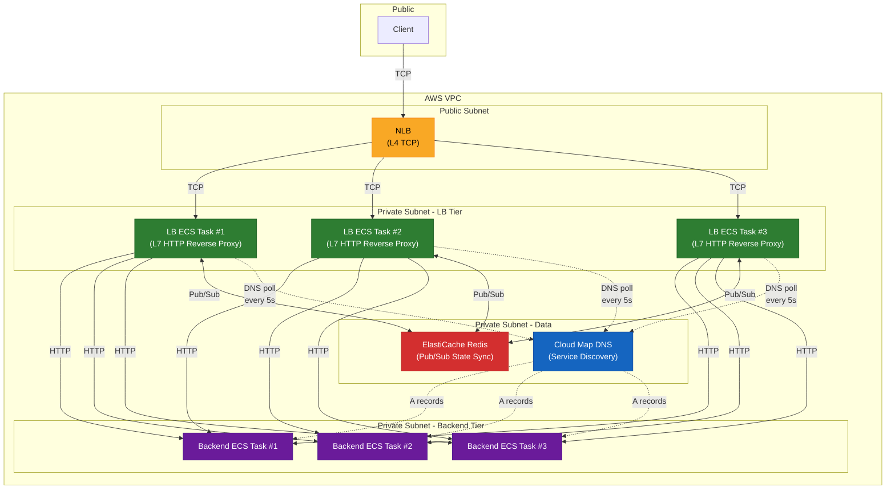
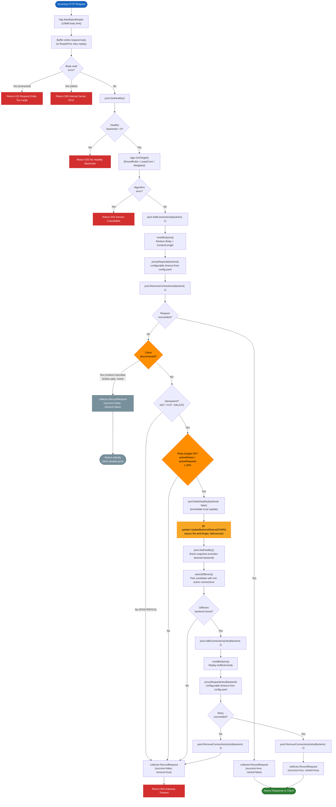
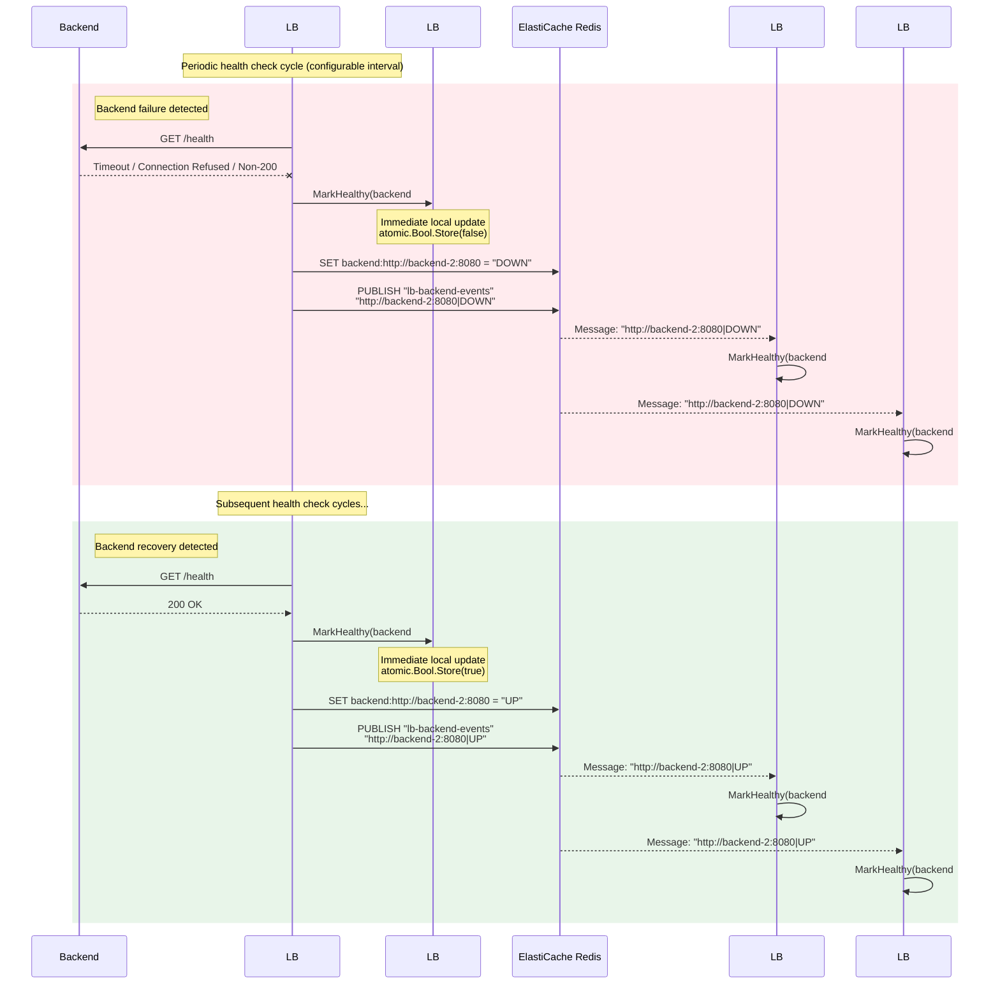
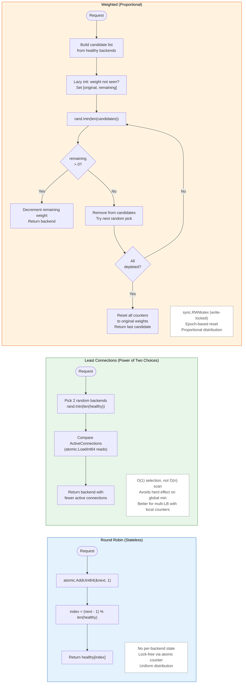

# Milestone 1 Report -- HA-L7-LB

**CS6650: Building Scalable Distributed Systems**
**Team**: Sai Karthikeyan Sura, Zhaoshan "Joshua" Duan
**Date**: March 29, 2026

---

## 1. Introduction and Motivation

Production load balancers like NGINX and HAProxy are powerful but opaque. Configuring them teaches operators *what* knobs to turn, but not *why* those knobs exist or how they interact under failure. This project builds a custom Layer 7 load balancer from scratch in Go to answer three questions that sit at the intersection of distributed systems and systems performance:

1. **What is the real cost of stateful routing?** Least-connections routing must track per-backend connection counts across all LB instances. How much latency does this coordination add compared to stateless round-robin, and does the tail-latency improvement justify it?

2. **How effective is idempotent retry under partial failure?** When a backend goes down mid-request, the LB can transparently retry GET/PUT/DELETE on a healthy backend. Under controlled chaos injection, how much does this reduce client-visible errors?

3. **Does horizontal LB scaling hit a coordination wall?** Adding LB instances behind an NLB increases throughput, but each instance must synchronize health state via Redis Pub/Sub. At what point does Redis contention cause sublinear scaling?

These questions are directly relevant to CS6650 themes: distributed state coordination, failure isolation, and horizontal scaling trade-offs. Building the system ourselves -- rather than benchmarking an existing one -- forces us to confront every design decision: how to propagate health state, when to retry, and where to place synchronization boundaries.

---

## 2. System Architecture

### 2.1 High-Level Overview

The system follows a two-tier proxy architecture deployed on AWS ECS Fargate:

An AWS Network Load Balancer distributes TCP connections across one or more LB tasks. Each LB task is a custom Go reverse proxy that routes HTTP requests to backend tasks using a pluggable algorithm. Backends register with AWS Cloud Map, and the LB discovers them via DNS polling every 5 seconds -- no static configuration required.

### 2.2 Key Design Decisions

**Redis Pub/Sub for state sync, not a shared database.** Each LB instance maintains its own in-memory backend pool (`repository.SharedState`). Redis Pub/Sub broadcasts health transitions (UP/DOWN) so that when one instance detects a backend failure, all other instances learn about it within milliseconds. This is cheaper and lower-latency than polling a shared database, and it avoids making Redis a hard dependency -- if Redis is unavailable, the LB runs in degraded mode with local-only health state.

**DNS-based service discovery.** Cloud Map provides a standard DNS interface for backend discovery. This decouples the LB from ECS internals and makes local development straightforward (just edit `/etc/hosts` or `config.yaml`).

**Atomic operations on the hot path.** Backend health (`atomic.Bool`) and active connection counts (`atomic.Int64`) use lock-free atomics. The `sync.RWMutex` on the server pool is only acquired to locate a `ServerState` by URL; the actual health and connection fields are read and written without holding the lock. This is critical for LeastConnections under high QPS, where every request reads connection counts across all backends.

**Graceful degradation.** The `health.StatusUpdater` (Redis propagator) may be nil if Redis is unreachable at startup. The health checker and proxy both nil-check the updater before calling it, so the LB continues to function with local-only state. This design choice reflects a core distributed systems principle: prefer availability over consistency when the coordination layer is down.

### 2.3 Request Lifecycle

The following diagram traces a single HTTP request through `proxy.ServeHTTP`, including the retry path for idempotent methods:

### 2.4 Health State Propagation

When one LB instance detects a backend failure, it updates local state immediately and broadcasts via Redis Pub/Sub so all other instances converge within milliseconds:

### 2.5 Subsystem Interfaces

All subsystems communicate through four interfaces defined in `internal/`:

| Interface | Responsibility | Implementations |
|-----------|---------------|-----------------|
| `repository.SharedState` | Backend pool CRUD, health marking, connection tracking | `InMemory` (sole impl) |
| `algorithms.Rule` | Target selection given pool state and request | `RoundRobin`, `LeastConnections`, `Weighted` |
| `health.StatusUpdater` | Propagate health changes to Redis | Redis publisher (or nil in degraded mode) |
| `metrics.Collector` | Record per-request latency, success, retry, timeout | In-memory with CSV export |

---

## 3. Implementation Status

### 3.1 Core Components

All core subsystems are implemented and tested:

- **Reverse proxy** (`internal/proxy/`): HTTP forwarding with request body buffering (max 10MB to prevent OOM), idempotent-method retry on failure or 5xx response, per-request connection tracking, configurable backend timeout, client disconnect detection, retry budget (20% cap to prevent cascading failures), and debounced Redis DOWN writes on concurrent failures.
- **Routing algorithms** (`internal/algorithms/`): Round-robin (atomic counter), least-connections via Power of Two Choices (pick 2 random backends, route to the lighter one -- better for multi-LB deployments with local-only counters), and weighted (proportional distribution with epoch-based reset).
- **Backend pool** (`internal/repository/`): In-memory `SharedState` with `sync.RWMutex` for the server list and `atomic.Bool`/`atomic.Int64` for per-server health and connection counts. Backends removed from DNS are now drained (kept with active connections) instead of immediately dropped.
- **Health checker** (`internal/health/`): Periodic HTTP health checks with configurable interval. Updates local state first, then propagates to Redis asynchronously if the updater is non-nil.
- **Metrics collector** (`internal/metrics/`): Per-request recording of latency, success/failure, timeout, and retry flags. Uses reservoir sampling (bounded to 10K samples) for latency tracking. Supports JSON summary, time-series snapshots (every 5s), and CSV export. Dumps to disk on SIGTERM.
- **DNS watcher** (`internal/discovery/`): Polls Cloud Map DNS every 5 seconds, adds/removes backends from the pool dynamically. Removed backends with active connections enter a draining state.
- **Graceful shutdown**: Drains in-flight HTTP connections via `http.Server.Shutdown` with a 10-second timeout before exit.
- **Redis sync** (`internal/repository/redismanager/`): Pub/Sub publisher and subscriber for cross-instance health state propagation, with periodic re-sync to heal missed messages, and proper `redis.Nil` vs. network error distinction.
- **Backend server** (`cmd/backend/`): Test backend with chaos injection support (`X-Chaos-Error`, `X-Chaos-Delay` headers).
- **Infrastructure** (`terraform/`): 8 modular Terraform configurations (network, ecr, ecs-lb, ecs-backend, nlb, elasticache, autoscaling, logging).

### 3.2 Test Coverage

Five test files covering all core packages:

| Test File | What It Covers |
|-----------|---------------|
| `internal/proxy/proxy_test.go` | Request forwarding, retry logic, connection tracking, body preservation across retries |
| `internal/algorithms/algorithms_test.go` | All 3 algorithms: distribution correctness, edge cases (zero weight, empty pool), concurrency safety |
| `internal/repository/in_memory_test.go` | CRUD operations, health marking, sync state, concurrent access patterns |
| `internal/health/checker_test.go` | Health state transitions (healthy-to-unhealthy, recovery), nil updater handling |
| `internal/metrics/collector_test.go` | Counter accuracy, percentile calculations, CSV export format, concurrent writes |

### 3.3 Codebase Metrics

| Metric | Value |
|--------|-------|
| Go source (non-test) | ~2,200 lines |
| Go test code | ~1,100 lines |
| Total Go | ~3,400 lines |
| Test files | 5 |
| Terraform modules | 8 |
| Terraform files | 28 |

**Technology stack**: Go 1.25, `go-redis/v9`, `gopkg.in/yaml.v3`, Docker multi-stage builds, AWS ECS Fargate, Terraform, Locust (Python) for load testing.

---

## 4. Initial Experimental Design

### 4.1 Experiment 1: Stateless vs. Stateful Routing Overhead

The three algorithms differ in complexity and state requirements:

**Question**: How much latency does least-connections routing add compared to stateless round-robin, and does it improve tail latency under uneven backend load?

**Setup**: Deploy 4 backend tasks behind the LB. Run Locust with 200 concurrent users for 5 minutes under each algorithm. Measure median latency, p99 latency, and RPS.

**Hypothesis**: Least-connections (Power of Two Choices) adds less than 5% overhead to median latency (two random picks plus one comparison), but improves p99 latency by 15-25% under uneven load because it avoids piling requests onto a slow backend.

**Chaos variant**: Inject `X-Chaos-Delay: 200` on one backend to simulate uneven load. Least-connections should route around the slow backend; round-robin will not.

### 4.2 Experiment 2: Failure Isolation and Retry Efficacy

**Question**: How much does transparent idempotent retry reduce client-visible error rates under partial backend failure?

**Setup**: Deploy 4 backends. Inject `X-Chaos-Error: 500` on 20% of requests via Locust. Compare client-visible error rates with retry enabled vs. disabled (single-attempt mode).

**Hypothesis**: Idempotent retry (GET/PUT/DELETE) reduces client-visible error rate by more than 50% under 20% failure injection. Non-idempotent methods (POST) see no improvement, confirming the safety boundary.

**Metrics**: Client-visible error rate, retry rate (from metrics endpoint), per-backend error distribution, total RPS impact of retries.

### 4.3 Experiment 3: Horizontal LB Scaling vs. Redis Contention

**Question**: Does adding LB instances behind the NLB scale throughput linearly, or does Redis Pub/Sub state synchronization become a bottleneck?

**Setup**: Run the same Locust workload (500 users, 10 minutes) against 1, 2, 4, and 8 LB instances. All instances share the same Redis (ElastiCache) for health state sync. Measure aggregate RPS, per-instance RPS, and Redis Pub/Sub message latency.

**Hypothesis**: RPS scales approximately linearly from 1 to 4 LB instances (each instance processes requests independently; Redis Pub/Sub is fire-and-forget). Beyond 4 instances, Redis message fan-out and subscriber processing may cause sublinear scaling, with diminishing returns visible in per-instance RPS.

### 4.4 Tooling

All experiments use Locust (`locust/locustfile.py`) with Docker Compose for distributed load generation. The LB's built-in metrics endpoint (`/metrics`, `/metrics/timeseries`, `/metrics/export`) provides server-side latency percentiles, retry counts, and per-backend statistics. On SIGTERM, the LB dumps metrics to disk as JSON and CSV, ensuring experiment data survives ECS task cycling.

**Current status**: Local smoke tests confirm all three algorithms route correctly, retry logic activates on backend failure, and metrics collection works end-to-end. Full-scale AWS experiments are pending deployment via Terraform.

---

## 5. Project Plan and Timeline

A detailed task breakdown is maintained in `docs/PROJECT_PLAN.md`. Key milestones:

| Date | Milestone |
|------|-----------|
| March 16 | Core implementation complete (proxy, algorithms, health, metrics, Redis sync) |
| March 30 | Milestone 1: Report, diagrams, local smoke tests, video walkthrough |
| March 29-30 | AWS deployment operational (ECS, NLB, ElastiCache, Cloud Map) |
| April 11 | Experiments 1 and 2 complete with data and charts |
| April 18 | Experiment 3 complete (horizontal scaling) |
| April 25 | Final report draft with all results and analysis |
| April 30 | Final submission: report, code, video |

Remaining work concentrates on three areas: (1) deploying the full infrastructure on AWS via Terraform, (2) running the three experiments at scale and collecting data, and (3) writing the final analysis with charts and conclusions.

---

## 6. Team Contributions

### Sai Karthikeyan Sura (Primary Author)

Designed and implemented the entire load balancer architecture from scratch. This includes all core subsystems: the reverse proxy with retry logic, all three routing algorithms, the health checker, the metrics collector, Redis Pub/Sub state synchronization, and DNS-based service discovery. Also authored the backend chaos injection server, the Locust experiment definitions, and all 8 Terraform infrastructure modules. Wrote the initial test suite covering all core packages.

Recent hardening work (PRs #34-43):
- **OOM protection** (PR #34): Enforced max body size (10MB) via `MaxBytesReader`.
- **Configurable timeout** (PR #35): Replaced hardcoded 2s timeout with config-driven value.
- **5xx retry** (PR #36): 5xx responses now trigger retry for idempotent methods, not just connection failures.
- **Client disconnect detection** (PR #37): Distinguished client-side disconnects from backend failures to avoid false DOWN marking.
- **Debounced Redis writes** (PR #38): Prevented redundant Redis DOWN writes on concurrent failures.
- **Retry budget** (PR #39): Capped retries at 20% of recent requests to prevent cascading failures.
- **Connection draining** (PR #40): Backends removed from DNS are kept in draining state until active connections complete.
- **Graceful shutdown** (PR #41): `http.Server.Shutdown` drains in-flight connections with 10s timeout on SIGTERM.
- **Reservoir sampling** (PR #42): Bounded metrics latency storage to 10K samples instead of unbounded slice.
- **Power of Two Choices** (PR #43): LeastConnections now picks 2 random backends and routes to the lighter one, improving fairness across multi-LB deployments with local-only counters.

### Joshua (Contributor & Experimenter)

Contributed targeted improvements through pull requests:

- **Redis error handling** (PR #29): Distinguished `redis.Nil` from network errors in `SyncOnStartUp`, preventing the LB from treating missing keys as connection failures.
- **Test thread safety** (PR #25): Fixed data races in test assertions and improved test reliability under the Go race detector.
- **Weighted zero-weight guard** (PR #27): Added a guard against zero-weight backends in the weighted algorithm to prevent division-by-zero panics.
- **DNS watcher ticker leak** (PR #26): Fixed a goroutine/ticker leak in the DNS watcher shutdown path.

### Going Forward

Zhaoshan "Joshua" Duan will lead the AWS deployment (target: March 29-30), experiment execution, and data analysis. Sai Karthikeyan will continue hardening the codebase and contribute to the final report. Both team members will review experiment results and co-author the final analysis.

