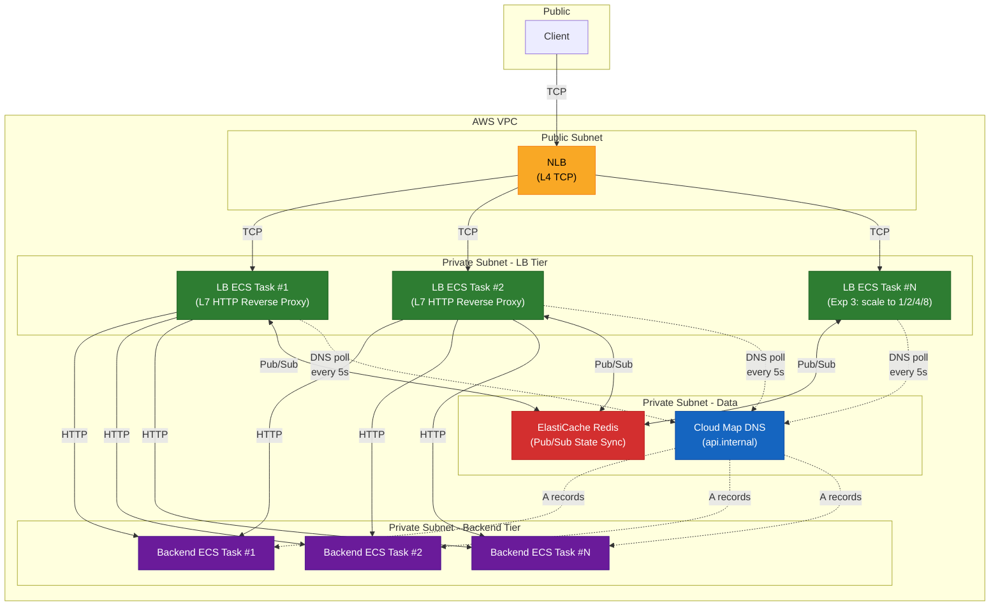
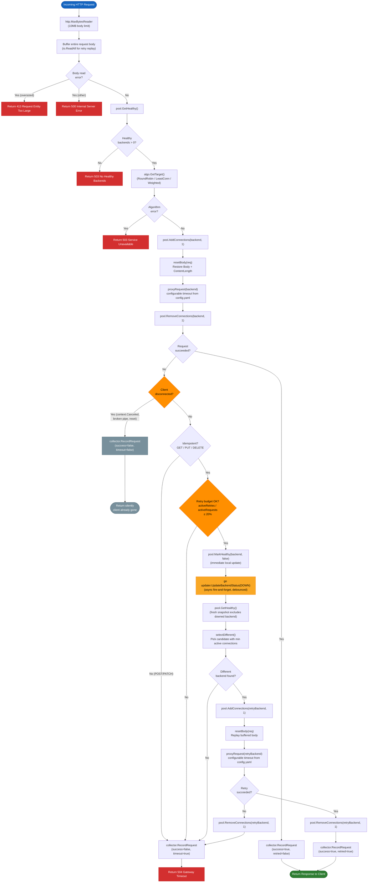
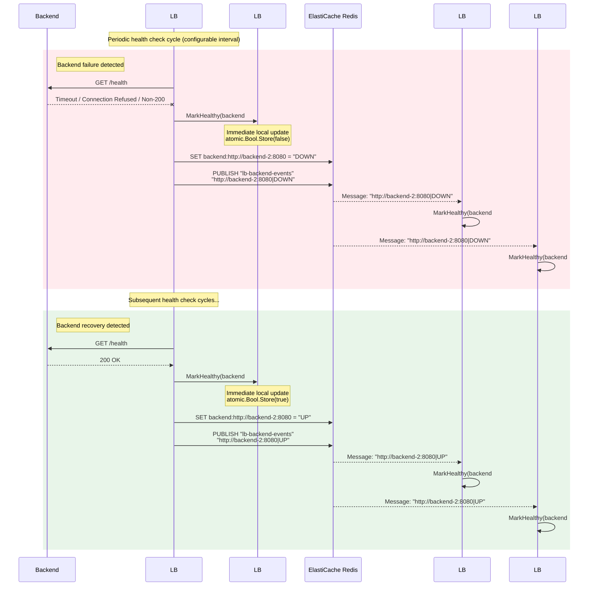
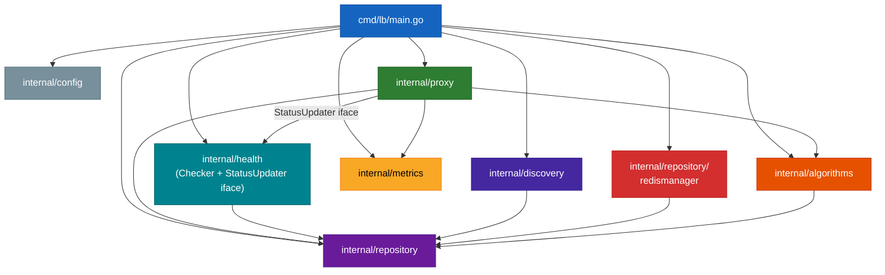
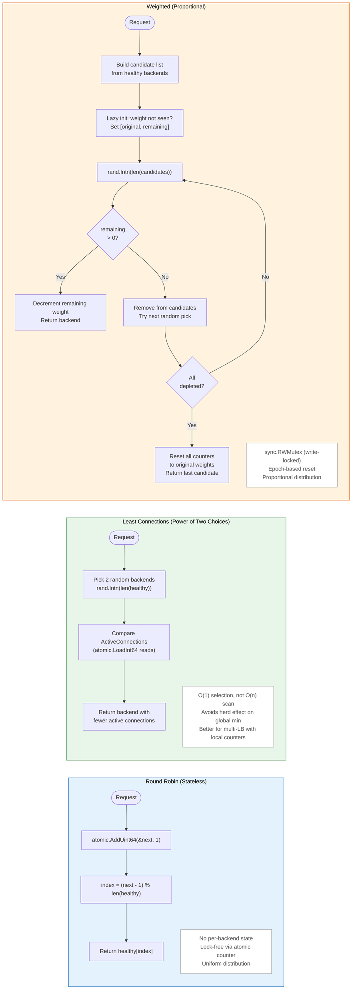

# HA-L7-LB Architecture Diagrams

## 1. System Architecture

**Experiment configurations:**
- **Sai's runs (homogeneous):** identical backends, same CPU/memory -- establishes baseline algorithm comparison
- **Joshua's runs (heterogeneous):** 1 strong (512 CPU / 1024 MB) + 1 weak (256 CPU / 512 MB) -- tests algorithm sensitivity to uneven backend capacity
- **Experiment 3:** LB count scales to 1/2/4/8 behind NLB

## 2. Request Lifecycle (proxy.ServeHTTP)

## 3. Health State Propagation

## 4. Package Dependency Map

## 5. Algorithm Comparison

