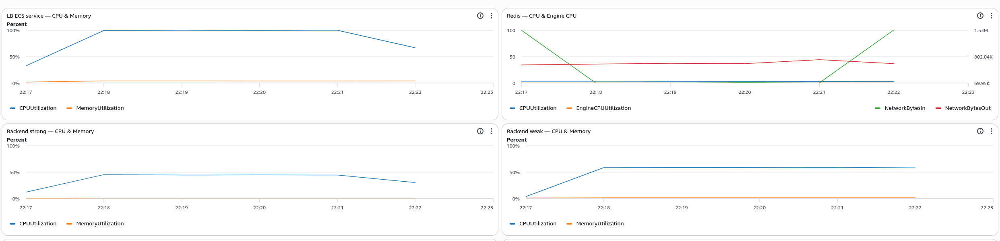
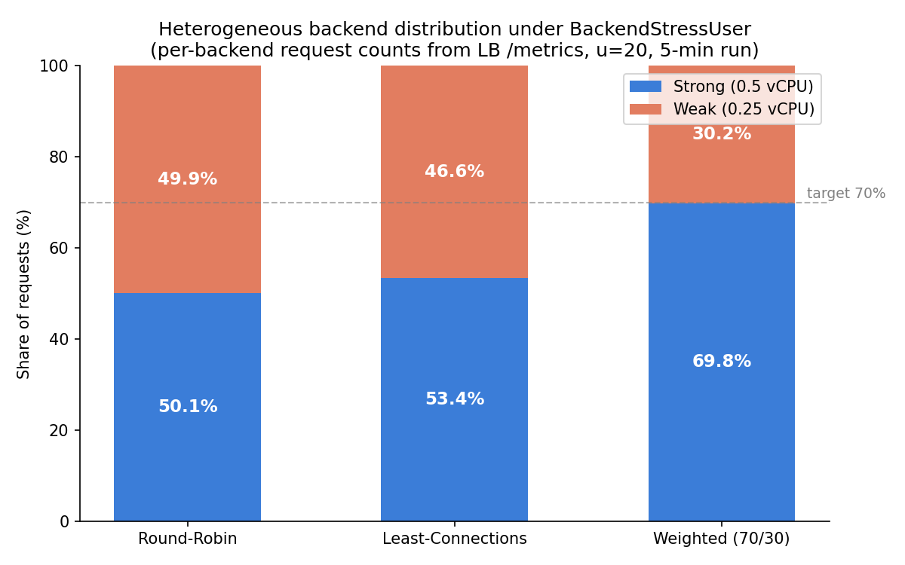
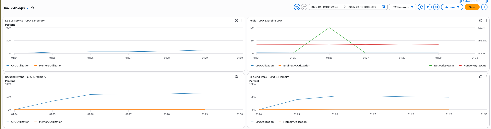
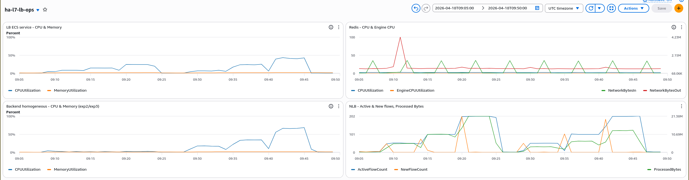
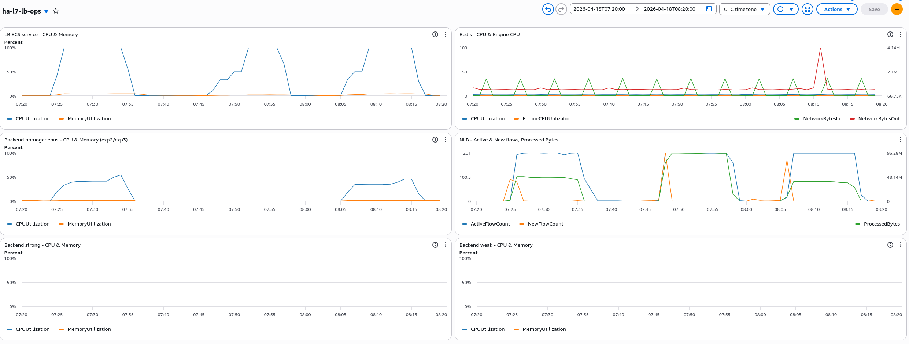
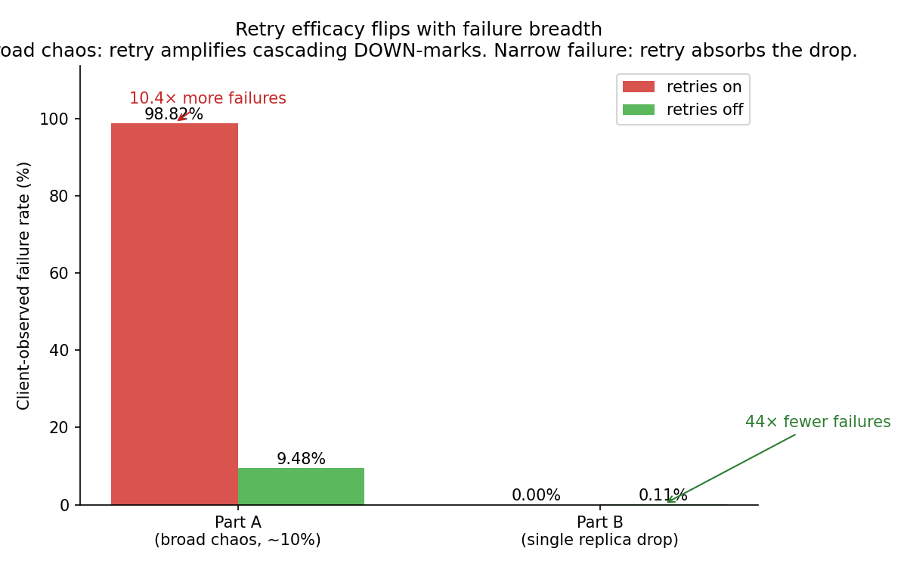
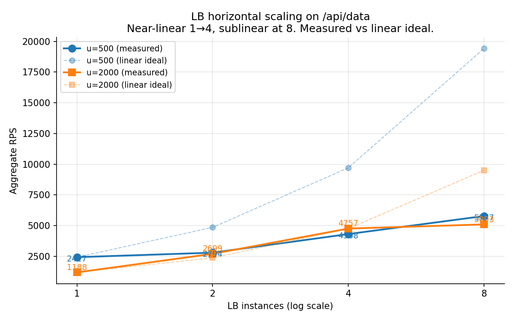
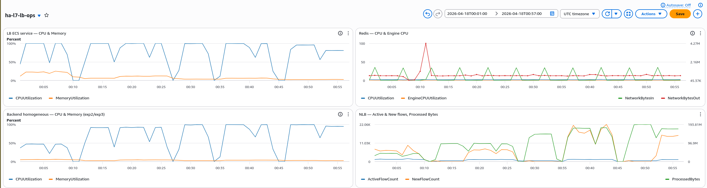
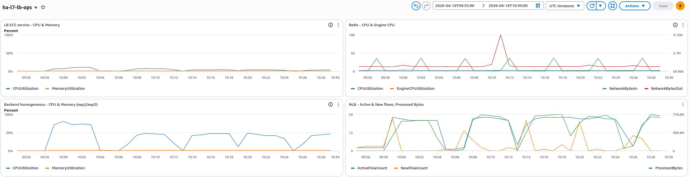

# Final Report — HA-L7-LB

**CS6650: Building Scalable Distributed Systems**

**Team**: Sai Karthikeyan Sura

**Date**: April 2026

**Repo**: [github.com/karthikeyansura/ha-l7-lb](https://github.com/karthikeyansura/ha-l7-lb)

---

## 1. Problem, Team, and Overview of Experiments

### The Problem

Production load balancers like NGINX, HAProxy, and Envoy hide the trade-offs that matter most: how much latency does connection-aware routing add over stateless round-robin? Does retry logic actually mask client-visible failures — and under which failure patterns? At what scale does cross-instance state coordination bottleneck throughput? These are knobs an operator turns every day, but the cost and benefit of each setting is rarely quantified for a given workload.

This project builds a custom high-availability Layer 7 load balancer from scratch in Go — pluggable routing algorithms (round-robin, least-connections via power-of-two choices, weighted), active health checking, idempotent-method retry with a 20% budget, and distributed state coordination via Redis Pub/Sub — so each tradeoff is observable end-to-end. Three experiments on AWS ECS Fargate make the trade-offs measurable: routing algorithm comparison on both identical and unequal backends (Exp 1), retry efficacy under chaos injection and graceful replica removal (Exp 2), and horizontal scaling of the LB tier on both LB-bound and backend-bound workloads (Exp 3).

The data surfaces three consequential findings that inform production LB configuration: capacity-aware routing (Weighted) delivers configured ratios to within 0.5 percentage points under mixed workload (§3); retry is a double-edged sword — 44× fewer failures under narrow failure, 10.4× more failures under broad chaos, from the same mechanism (§4); and scaling the LB tier is waste when the backend is the bottleneck, a distinction auto-scaling policies must respect (§5).

### The Author

**S Karthikeyan Sura** — sole author.

- **Core LB implementation**: built the HA L7 load balancer from scratch in Go (Issues & PRs #1-65) — pluggable routing algorithms, active health checking, Redis Pub/Sub coordination, DNS-based backend discovery, retry logic with 20% budget.
- **Infrastructure**: authored all Terraform modules; led the AWS ECS Fargate deployment.
- **Experimental design**: defined the three experiments and their scenarios.
- **Milestone 1 data**: Experiment 1 homogeneous `/api/data` runs (RR / LC / Weighted).
- **Final-phase data**: Experiment 1 hetero Weighted 70/30 run and the full 2×3 robustness matrix; Experiment 2 Parts A and B, including the low-chaos retune and the CPU-heavy `/api/compute` variant, plus LB `/metrics` mechanism captures; Experiment 3 horizontal scaling on both `/api/data` and `/api/compute`.
- **Backend test harness**: `/api/compute`, `/api/payload`, `/api/stream` stress endpoints; chaos-injection hooks (`X-Chaos-Error`, `X-Chaos-Delay`); `scripts/capture_lb_metrics.sh`.
- **Report**: drafted and edited this document.

### Overview of Experiments

| Experiment | Question | Scope | Headline finding |
|-----------|----------|-------|------------------|
| **1. Routing algorithms** | Does algorithm choice measurably change throughput, latency, and per-backend distribution — and does the answer depend on whether backends are equal? | RR / LC / Weighted × {homo, hetero} on `/api/data` (500 users) and on `BackendStressUser` mixed workload — 40% `/api/compute`, 30% `/api/data`, 20% `/api/payload`, 10% `/api/stream` (20 users) | Weighted 70/30 delivered 69.8/30.2 on mixed workload; RR ignores capacity; LC splits the middle |
| **2. Retry efficacy** | Does idempotent-method retry reduce client-visible failures? When does it backfire? | Chaos injection (~10% of requests) on `/api/data` and `/api/compute`, plus mid-run replica removal | 44× fewer failures on replica drop; 10.4× *more* failures under broad chaos — the same retry mechanism inverts with failure breadth |
| **3. Horizontal scaling** | Does scaling the LB tier deliver linear throughput gains? | lb_count ∈ {1, 2, 4, 8} on `/api/data` (LB-bound) and `/api/compute` (backend-bound) | LB-bound workload scales 1→8 at 2.4× aggregate; backend-bound workload is flat because backend is the bottleneck |

**Role of AI**: Claude Code was used for code review, documentation, and report drafting. Core Go LB implementation, Terraform authoring, and experimental design were done by the author. AI-generated prose was reviewed before inclusion.

**Observability**: The LB exposes `/metrics`, `/metrics/timeseries`, `/metrics/export` (CSV), and `/health/backends` on port+1000. Metrics dump to disk on SIGTERM; CloudWatch Logs capture ECS stdout. `scripts/capture_lb_metrics.sh` takes per-run snapshots via SSM — retry counts, per-backend distribution, and current backend health state.

**Reproducibility**: Every figure and number traces to a file under `results/` — see §9 Appendix. Infrastructure: `terraform apply` on `main`.

---

## 2. Methodology

### 2.1 Architecture

```
Client → NLB (L4, TCP) → LB ECS Tasks (L7, custom Go proxy) → Backend ECS Tasks
                              │
                        ElastiCache Redis (Pub/Sub state coordination)
                              │
                        AWS Cloud Map DNS (backend service discovery, 5 s poll)
```

The L7 load balancer is a custom Go reverse proxy (~2000 LOC). It discovers backends dynamically via Cloud Map DNS — one DNS watcher per configured backend endpoint, each with a `sourceTag` for reconciliation. Multiple DNS sources coexist in a single backend pool (strong + weak tiers share one LB but populate from separate DNS entries with separate weights). Redis Pub/Sub synchronizes health state across horizontally scaled LB instances, with a degraded mode for Redis unavailability that falls back to local-only health tracking.

### 2.2 Routing algorithms

Three algorithms live behind a `Rule` interface (`internal/algorithms/`):

- **Round-Robin** — atomic counter; `O(1)` per request; no state.
- **Least-Connections** — *power-of-two choices* (Mitzenmacher 2001): pick two random backends, route to the one with fewer active connections. `O(1)` per request, robust under many LB instances with local-only connection counts (avoiding a cross-instance coordination bottleneck).
- **Weighted** — proportional distribution matching configured per-backend weights.

### 2.3 Retry policy

The proxy retries failed idempotent requests (GET, PUT, DELETE) on a different backend, subject to three guards:

1. **Retry budget** — at most 20% of in-flight requests may be retries at any time. Prevents runaway amplification when many requests fail at once.
2. **Backend DOWN-mark on 5xx** — any 5xx response or proxy timeout causes the LB to mark that backend DOWN locally via `pool.MarkHealthy()`, then propagate to Redis Pub/Sub (debounced — redundant transitions suppressed).
3. **Client-disconnect detection** — `context.Canceled`, broken pipe, and connection-reset errors are classified as client-side and do *not* trigger DOWN-marking or retries.

POST and PATCH are never retried. A configurable proxy timeout (default 5 s) bounds each attempt.

### 2.4 Health checking

The LB runs a periodic health probe (default 10 s interval, 5 s timeout per probe) against each backend's `/health` endpoint. A failed probe marks the backend DOWN; a subsequent successful probe returns it to UP. Health probes run in the same goroutine pool as request handling — under heavy CPU pressure the probe can time out even while application traffic succeeds, which (as Exp 3b demonstrates) is a known limitation.

### 2.5 Chaos-injection protocol

The backend's `/api/data` and `/api/compute` handlers honor two request headers used by Locust for controlled fault injection:

- `X-Chaos-Error: <status-code>` — backend returns that HTTP status immediately (default 500).
- `X-Chaos-Delay: <ms>` — backend sleeps `ms` milliseconds before responding. Delays exceeding the proxy's 5 s timeout exercise the timeout path.

Locust's `ChaosInjectionUser` class injects chaos on ~10% of requests (18/1/1/1 task weights: normal/chaos_500/chaos_delay/health → 2 chaos tasks out of 21 total = 9.52%). This rate was tuned down from the original 30% after an initial run saturated the DOWN-marking cascade and obscured the retry-on vs retry-off delta (the original 30% data is retained in `exp2/` for contrast).

### 2.6 Infrastructure and workload generation

All infrastructure is provisioned via modular Terraform (`terraform/modules/{network,ecs-lb,ecs-backend,nlb,elasticache,locust,logging,ecr,autoscaling}`). Backend tasks run in two CPU/memory configurations for Exp 1 heterogeneous: strong (0.5 vCPU / 1 GiB) and weak (0.25 vCPU / 0.5 GiB). Homogeneous runs use two 0.25-vCPU backends.

Load generation uses Locust in headless mode on a c6i.xlarge EC2 instance in the same VPC — same-VPC deployment minimizes network jitter from measurements — driven remotely via `aws ssm send-command`. Eight Locust user classes (`AlgorithmCompareUser`, `ChaosInjectionUser`, `ChaosInjectionComputeUser`, `ScalingBaselineUser`, `ScalingSpikeUser`, `BackendStressUser`, `ScalingBaselineComputeUser`, `ScalingSpikeComputeUser`) target the NLB DNS name.

Experiment parameters are controlled via `config.yaml` (routing policy, retry enablement, backend endpoints) and Terraform variables (`lb_count`, `backend_min`, `retries_enabled`). Config changes propagate via Docker image rebuild (triggered by a source-hash) and ECS rolling restart.

---

## 3. Exp 1 — Routing Algorithm Comparison

### 3.1 Hypothesis

Routing-algorithm choice matters most when backends differ in capacity. On identical backends, Round-Robin, Least-Connections (LC), and Weighted should produce similar request distributions and latencies — all three see each backend as equivalent. On unequal backends, the three algorithms should behave measurably differently: RR distributes equally regardless of capacity, LC self-balances toward the underloaded backend, and Weighted respects a configured ratio. A robust load balancer should additionally hold up under diverse request workloads — not just trivial JSON responses, but mixed CPU-bound, bandwidth-heavy, and long-lived streaming requests.

### 3.2 Setup

**Core algorithm comparison** (`/api/data`, from milestone 1):
- Homogeneous: 2 identical 0.25-vCPU backends, 500 users × 5 min, `AlgorithmCompareUser`.
- Heterogeneous: 1 strong (0.5 vCPU / 1 GiB) + 1 weak (0.25 vCPU / 0.5 GiB), same load, RR + LC only (Weighted was blocked on a DNS-watcher fix at milestone 1).

**Weighted heterogeneous 70/30** (after the DNS fix landed):
- Same 1-strong + 1-weak topology, 2 LB tasks, 500 users × 5 min, `AlgorithmCompareUser`.
- Config: `weight: 70` on `api-strong.internal`, `weight: 30` on `api-weak.internal`.
- ECS console screenshots corroborating the CPU/memory split live at `results/final/exp1/weighted_hetero_70_30/ecs_{strong,weak}_{config,tasks}.png`.

**Robustness extension** (`BackendStressUser`, mixed workload: 40% `/api/compute`, 30% `/api/data`, 20% `/api/payload` (1 MB), 10% `/api/stream` (chunked, 2-second hold)):
- Full 2×3 matrix: {homogeneous, heterogeneous} × {RR, LC, Weighted 70/30}. 20 users × 5 min per cell.

### 3.3 Results

#### Core /api/data (milestone 1 data)

On **homogeneous** backends, LC and Weighted dramatically outperform RR on tail latency despite identical per-backend capacity. p99 drops by 52-55% and max by 51-75% going from RR to Weighted:

| Metric | Round-Robin | Least-Connections | Weighted |
|--------|-------------|-------------------|----------|
| RPS | 1,269 | 1,482 | 1,523 |
| p99 | 920 ms | 440 ms | 410 ms |
| Max | 2,698 ms | 1,314 ms | 663 ms |

On **heterogeneous** (strong + weak), LC provided only modest tail improvement over RR because the LB was CPU-bound (~99%) at 500 users — the LB itself was the bottleneck, masking algorithm differences. Weak backend ran ~71% CPU vs strong at ~37% under both RR and LC.

#### Weighted 70/30 on heterogeneous

The Weighted algorithm delivered the configured split to four significant figures:

| Backend | Private IP | Requests | % |
|---------|-----------|----------|---|
| Strong (0.5 vCPU) | 172.31.26.56 | 519,167 | **70.0%** |
| Weak (0.25 vCPU) | 172.31.51.33 | 222,525 | **30.0%** |

*Source: `results/final/exp1/weighted_hetero_70_30/lb_snapshots_end/*_metrics.json` — aggregated across 2 LB tasks.*

At 500 users, zero failures, RPS 2,406, p99 180 ms.



*Figure 1: CloudWatch view of the Weighted 70/30 heterogeneous run — LB pinned at 100% CPU (the bottleneck at 500 users), strong backend at ~45% CPU, weak backend at ~55% CPU. The weak backend runs hotter relative to its smaller capacity despite receiving only 30% of traffic — consistent with its 2× lower CPU budget. `results/final/exp1/weighted_hetero_70_30/exp1-dashboard_end0.png` (companion `end1.png` shows the second LB task with the same pattern).*

#### Robustness matrix (BackendStressUser, mixed workload)

All 6 cells completed with **zero failures**. The critical cells are heterogeneous, where algorithm differences manifest cleanly in per-backend distribution:

| Topology | Policy | RPS | p99 | Strong / Weak split (LB's view) |
|----------|--------|-----|-----|---------------------------------|
| Homo | RR | 52.6 | 2,100 ms | (no distribution to measure — identical backends) |
| Homo | LC | 53.2 | 2,200 ms | 45.1 / 54.9 (symmetric noise) |
| Homo | Weighted(100) | 49.9 | 2,400 ms | 49.9 / 50.1 (degenerate — single weight) |
| **Hetero** | **RR** | **52.0** | **2,300 ms** | **50.1 / 49.9** — ignores capacity |
| **Hetero** | **LC** | **54.6** | **2,200 ms** | **53.4 / 46.6** — mild strong bias |
| **Hetero** | **Weighted(70/30)** | **53.8** | **2,200 ms** | **69.8 / 30.2** — configured ratio honored to <0.5 pp |

*Source: `results/final/exp1_robustness/*_stress_u20_end/lb_snapshots/lb0_metrics.json`.*



*Figure 2: Per-backend request distribution on heterogeneous backends (strong = 0.5 vCPU, weak = 0.25 vCPU) under `BackendStressUser` mixed workload. Round-Robin ignores capacity (50/50); Least-Connections mildly favors strong (53/47); Weighted 70/30 honors the configured ratio to within 0.5 percentage points. Generated from `results/final/exp1_robustness/hetero_*_end/lb_snapshots/lb0_metrics.json`.*

Dashboards for each cell (CloudWatch) in `results/final/exp1_robustness/<run>/dashboard.png`. The hetero captures show the **Backend strong** and **Backend weak** panels with data for the first time — strong CPU climbs to ~65% and weak to ~50% under Weighted, consistent with the 70/30 traffic split on 2:1 capacity ratio.



*Figure 3: CloudWatch view of the hetero Weighted(70/30) robustness run. `BackendStressUser` mixed workload at u=20 drives backend strong (bottom-left panel) to ~65% CPU and backend weak (bottom-right) to ~50% — both backends productive, strong doing proportionally more work in absolute terms. Same pattern appears (at smaller magnitudes) for RR and LC in the other dashboards; only here do the percentages line up with the configured 70/30 split.*

p99 of ~2 seconds across all robustness cells is dominated by `/api/stream`'s 2-second chunked hold (not algorithm overhead) — the LB passes through the stream without injecting latency.

### 3.4 Interpretation

1. **On identical backends, all algorithms converge** to near-even distribution. LC and Weighted still produce lower tail latency on `/api/data` because of scheduling noise: LC picks the less-loaded backend, reducing the impact of transient per-request latency variance. But on mixed workload where latency is dominated by endpoint (stream), the algorithm choice disappears from the tail.
2. **On heterogeneous backends, algorithm choice is consequential**. The 50 → 53 → 70 progression in strong-backend share is exactly the capacity-awareness progression: RR is blind, LC peeks (power-of-two-choices with local connection counts), Weighted is told. Only Weighted matches the configured capacity ratio; LC's bias is mild and depends on load enough to actually differentiate backend queue depths.
3. **The Weighted algorithm generalizes beyond `/api/data`**. The 70/30 split held under `AlgorithmCompareUser` at 500 users (70.0 / 30.0) *and* under `BackendStressUser` at 20 users with mixed compute/payload/streaming requests (69.8 / 30.2). The weighting mechanism is workload-agnostic — it counts requests, not bytes or CPU, and the ratio holds.

---

## 4. Exp 2 — Retry efficacy and the cascading DOWN mechanism

### 4.1 Hypothesis

Retries on idempotent methods reduce client-observed failures when backends fail intermittently. The 20% retry budget (only 20% of in-flight requests may be retries at any time) prevents runaway retry amplification under heavy load. Redis Pub/Sub synchronizes health state across LB instances so a backend marked DOWN by one LB is quickly reflected on the others.

A subtler prediction: **retries are a double-edged sword**. Under *narrow* failure (one backend goes away), retries route around it and succeed. Under *broad* failure (a significant fraction of requests hit a bad backend), retries can *accelerate cascading failure* — each retry triggers its own DOWN-mark on a backend that returns 5xx, spreading the DOWN state across the pool via Redis Pub/Sub until no backends remain healthy.

### 4.2 Setup

**Part A — chaos injection** (broad failure). Locust sends a mix of requests; a fraction include `X-Chaos-Error: 500` or `X-Chaos-Delay: 6000-10000` headers which force the backend to either return 500 or sleep past the LB's 5 s proxy timeout.

Three variants:
- **Original (30% chaos)** on `/api/data`: 6 runs, u=50/100/200 × retry {on, off}. `exp2/`. At this rate retry-on cascaded to 99.0 / 99.5 / 99.7% failure across u=50/100/200 — the cascade was near-total regardless of user count, leaving no retry-on vs retry-off delta to observe.
- **Low-chaos retune (~10% chaos)** on `/api/data` — the original rate saturated the system and masked the retry delta, so we re-ran at a lower injection rate: `exp2a_low_chaos/`.
- **CPU-heavy variant** (~10% chaos) on `/api/compute` (SHA-256 hashing, 2000 iterations per request): `exp2a_compute_chaos/`.

**Part B — replica drop** (narrow failure). `ScalingBaselineUser` at u=200 with retries on/off against 4 homogeneous backends. At T+150s of a 10-min run, one backend is removed mid-flight via `aws ecs update-service --desired-count 3`. `exp2b/`.

### 4.3 Results

#### Part A low-chaos /api/data (~10% chaos injection)

| Users | Retries | Total reqs | Failures | Failure % | p99 |
|-------|---------|-----------|----------|-----------|-----|
| 50  | **on**  | 45,529 | 41,621 | **91.4%** | 23 ms |
| 100 | **on**  | 95,590 | 93,145 | **97.4%** | 11 ms |
| 200 | **on**  | 192,943 | 190,665 | **98.8%** | 2 ms |
| 50  | off | 26,456 | 2,517 | 9.5% | 5,000 ms |
| 100 | off | 53,714 | 4,985 | 9.3% | 5,000 ms |
| 200 | off | 106,590 | 10,100 | 9.5% | 5,000 ms |

*Source: `results/final/exp2a_low_chaos/*/stats.csv`.*

**The result inverts intuition**: retry-on is *worse*, not better. Failure rate with retries on is 9.6× to 10.5× higher than with retries off, and the gap widens with load. Latency tells the other half of the story: retry-on has a p99 near zero (the LB fails fast because no backends are healthy), while retry-off has p99 at the 5-second timeout (real responses hitting chaos delays complete normally).

#### Part A CPU-heavy variant (/api/compute, same ~10% chaos)

Same pattern — retry-on cascades worse than retry-off despite a completely different backend workload:

| Users | Retries | Failure % |
|-------|---------|-----------|
| 200 | on  | **98.5%** |
| 200 | off | **9.4%** |

*Source: `results/final/exp2a_compute_chaos/retry_{on,off}_200/stats.csv`.*

**The smoking gun**: compare the CloudWatch *backend CPU* utilization between retry-on and retry-off runs:



*Figure 4: 45-min CloudWatch window covering all 6 compute-chaos runs. Backend homogeneous CPU (bottom-left panel) is flat at ~0% during the retry-on runs (09:08-09:25) and spikes to ~65% during retry-off runs (09:29-09:46). Same chaos rate, same workload, opposite backend behavior. `results/final/exp2a_compute_chaos/phase_overview.png`.*

On retry-on, the cascade completes within seconds: every chaos-500 triggers a DOWN-mark, retries on the next backend also hit chaos and trigger more DOWN-marks, Redis Pub/Sub fans the DOWN state to all LB tasks, and within ~30 s all backends are unhealthy. Subsequent requests return 503 immediately (p99 near zero), backends are starved of traffic (CPU = 0%). On retry-off, only the ~10% of requests that directly hit chaos fail; the remaining ~90% reach healthy backends, which process normal traffic — CPU climbs to 65% as expected.

#### Part B — replica drop (narrow failure)

Opposite story. Under a single replica drop at T+150s:

| Variant | Requests | Failures | Fail % | RPS | p99 |
|---------|----------|----------|--------|-----|-----|
| retry_on_replicadrop  | 850,924 | **18**  | **0.002%** | 1,421 | 180 ms |
| retry_off_replicadrop | 692,695 | **784** | **0.113%** | 1,157 | 270 ms |

**44× fewer failures with retries on.** Retries successfully route around the draining backend. The LB's own view confirms the mechanism — 4 retry attempts fired across ~123k requests on LB task 0, of which 2 succeeded on a second backend:

| Metric (from `exp2b/mechanism_capture_end/lb_snapshots/lb0_metrics.json`) | Value |
|---|---|
| TotalRequests | 123,535 |
| RetriedRequests | **4** |
| Retry success rate | **50%** (2 of 4) |
| LatencyP99 | 51 ms |
| Dropped backend served | 18,543 (first 60 s) |
| Each remaining backend served | ~34,997 (full 120 s) |



*Figure 5: 60-minute CloudWatch window covering both Part B runs. Two primary LB-CPU plateaus (top-left) mark the retry_on run at 07:24-07:35 and the retry_off run at 08:06-08:17; the plateau between them is auxiliary infrastructure work during the `retries_enabled` toggle. The Redis `NetworkBytesOut` spike (top-right, red line) at ~08:11 is the LB broadcasting DOWN-marks on retry_off following the replica drop at 08:08:39 (T+150s into the retry_off run). Individual dashboards at `exp2b/retry_{on,off}_replicadrop/dashboard.png`.*

### 4.4 Interpretation — when retries help vs hurt

The two halves of Exp 2 reveal opposite retry behaviors:

- **Narrow failure (one backend drops, others healthy)**: retry-on wins decisively. The 20% retry budget caps amplification; retries reach a healthy backend and mask the drop from the client. 44× failure reduction, no cascade.
- **Broad failure (≥10% of requests hit chaos across the pool)**: retry-on *loses*. Every retry attempt also has ~10% chance of hitting chaos. Each 5xx triggers a DOWN-mark that propagates via Redis Pub/Sub. The cascade completes in ~30 s and the pool is unusable until chaos stops and the health checker re-marks backends healthy.



*Figure 6: Client-observed failure rate with retries on vs off across the two Part A scenarios (broad chaos at ~10%, u=200) and Part B (single replica drop, u=200). Under broad failure retry-on has 10.4× *more* failures because cascading DOWN-marks propagate via Redis Pub/Sub; under narrow failure retry-on has 44× *fewer* failures (18 vs 784 raw counts) because retries reach a healthy backend. Generated from `exp2a_low_chaos/retry_{on,off}_200/stats.csv` and `exp2b/retry_{on,off}_replicadrop/stats.csv`.*

The LB's cascading DOWN-mark mechanism — which protects against isolated bad backends via aggressive retry-then-eject — becomes a liability under broad chaos. Two design improvements would decouple this edge:

1. **Separate ejection from retry**: mark DOWN based on a *running 5xx rate*, not per-request, so a brief spike doesn't eject a healthy backend.
2. **Graduated health policy**: require N consecutive failures (not just one) before DOWN; introduce a HALF-OPEN probe state before resuming full traffic.

These match what NGINX / HAProxy / Envoy do; our simpler "one 5xx → DOWN → retry on another backend" rule works for narrow failure but is too aggressive for broad failure.

---

## 5. Exp 3 — Horizontal Scaling

### 5.1 Hypothesis

The LB coordinates health state via Redis Pub/Sub. Scaling LB instances should increase aggregate throughput near-linearly up to some point, then sublinearly as Redis contention grows. Backend-bound workloads should show a different curve — LB throughput is not the bottleneck, so scaling LB instances doesn't help.

### 5.2 Setup

**`/api/data` (trivial workload)**: `ScalingBaselineUser` at u=500 and u=2000, `ScalingSpikeUser` at u=2000, LB count swept 1/2/4/8. 5 min per run. `exp3/`.

**`/api/compute` (CPU-bound workload)**: `BackendStressUser` at u=20, same 1/2/4/8 LB sweep. `exp3_compute/`. (Higher loads on compute collapsed into the Exp 2 cascade — see `exp3b/` for the documented negative result.)

### 5.3 Results

#### /api/data scaling

| lb_count | u=500 RPS | u=2000 RPS | u=2000 p99 |
|----------|-----------|------------|------------|
| 1 | 2,427 | 1,188 | 11,000 ms |
| 2 | 2,794 | 2,699 | 10,000 ms |
| 4 | 4,308 | 4,757 | 7,200 ms |
| 8 | 5,777 | 5,093 | 250 ms |

At u=500 throughput scales 1→4 (2,427 → 4,308, 1.78×) then continues to 8 (5,777, 2.38× over lb=1). At u=2000 the lb=1 instance is saturated (p99 at 11 s — requests queue behind the single overloaded LB), but scaling to lb=8 clears the saturation cleanly — p99 drops from 11,000 ms to 250 ms, a **44× tail-latency improvement**.

Burst traffic (`ScalingSpikeUser` at u=2000, designed to stress Redis Pub/Sub under rapid bursts) produced nearly identical numbers at each LB count (1,170 / 2,690 / 4,746 / 5,088 RPS) — differences under 1% from sustained u=2000, indicating Redis coordination does not behave differently under burst vs sustained load at these scales. Data: `exp3/lb{1,2,4,8}_spike/`.



*Figure 7: Aggregate RPS vs LB instance count on `/api/data`. Solid = measured, dashed = linear-ideal extrapolation from lb=1. At u=500 the system scales near-linearly 1→4 then diminishes at 8 (2.38× over baseline vs 8× ideal). At u=2000 lb=1 is saturated (p99 at 11 s); scaling relieves the bottleneck — p99 drops 44× from 11,000 ms at lb=1 to 250 ms at lb=8. Generated from `results/final/exp3/lb{1,2,4,8}_u{500,2000}/stats.csv`.*



*Figure 8: CloudWatch overview of the /api/data scaling sweep at u=2000 — a 55-minute window covering all four lb_count runs (1, 2, 4, 8) with rolling restarts between. LB-task CPU (top-left) and backend CPU (bottom-left) both show repeated 100% saturation plateaus: at u=2000 both tiers are driven hard. The key signal is the top-right Redis panel — CPU stays near 0 throughout, confirming Redis Pub/Sub coordination is not the scaling bottleneck at any lb_count ≤ 8. The initial NetworkBytesOut spike (red, ~00:10) is the LB startup broadcasting initial UP states via Pub/Sub. `results/final/exp3/dashboard_overview_u2000.png`.*

#### /api/compute scaling

| lb_count | RPS | p99 |
|----------|-----|-----|
| 1 | 49.9 | 2,300 ms |
| 2 | 56.0 | 2,000 ms |
| 4 | 57.6 | 2,100 ms |
| 8 | 55.4 | 2,100 ms |

Throughput is **flat** at ~55 RPS across all four LB counts. The CloudWatch phase overview confirms the mechanism — LB CPU stays below 15% throughout while backend CPU is the pacing signal (starting at ~75% on lb=1 and dropping as the backend ECS service autoscales to meet its 70% CPU target):



*Figure 9: 35-min CloudWatch window covering all 4 compute scaling runs (lb=1, 2, 4, 8 in sequence). LB CPU (top-left) and Backend homogeneous CPU (bottom-left) tell opposing stories: LB stays below 15% at every scale, backend ranges 45-75% and is the active scaling signal — ECS autoscaling grew the backend tier between runs to hold backend CPU near its 70% target. Adding LB instances doesn't help because the backend (not the LB) is the work-bounded tier. `results/final/exp3_compute/phase_overview.png`.*

#### Exp 3b — compute at u=500 (documented negative result)

Running `BackendStressUser` at u=500 on `/api/compute` collapsed into the Exp 2 cascade: chaos is not even enabled, but the backend's `/health` endpoint shares the same CPU-starved task, so its response exceeds the 5 s health-check timeout. The health checker marks backends DOWN under pure overload. Even with `retries_enabled=false`, ~94-99% of requests return 503.

*Source: `results/final/exp3b/README.md` and `results/final/exp3b/exp3b_lb1_u500_compute_attempt/locust.log`.*

This is a real finding about *health-check isolation*: a production system would give the health endpoint a dedicated goroutine pool so `/health` latency never correlates with application work. Our LB has no such isolation; it's a known limitation documented here.

### 5.4 Interpretation

The `/api/data` scaling curve is classic — linear to sublinear as bottlenecks shift. At u=500 lb=1→4 scales near-linearly (2,427 → 4,308 RPS, 1.78×) and lb=4→8 still improves meaningfully (+34% to 5,777 RPS) because the LB tier remains the bottleneck: each LB saturates its own CPU and adding more LBs adds aggregate CPU headroom. At u=2000 the picture changes — lb=4→8 flattens (4,757 → 5,093 RPS, +7%). Figure 8 points at the mechanism: Redis CPU stays near 0 throughout, but backend homogeneous CPU hits 100% repeatedly. So the u=2000 flattening at lb=8 is **backend-bound**, not Redis-bound. For this project's scale, Redis Pub/Sub handles up to 8 LBs comfortably; the scaling limit comes from the downstream tier.

The `/api/compute` result demonstrates the complementary point: **scaling the LB tier doesn't help when the backend is the bottleneck**. For applications where request processing is cheap (JSON APIs, cache lookups), LB throughput is the limit and horizontal scaling works. For applications where processing is heavy (ML inference, batch transforms, media encoding), backend capacity is the limit and scaling LBs wastes effort. A production auto-scaling policy should watch *backend* CPU as its primary signal, not LB CPU, for compute-bound services.

The Exp 3b negative result sharpens a design lesson: health-check *isolation* matters under overload. A health endpoint that shares a CPU budget with request handling will time out under load, triggering spurious DOWN-marks and amplifying the overload into a cascade. Our LB's 5-second health timeout was chosen for sensitivity to real failures; under heavy CPU contention it becomes a liability. Production LBs handle this by either (a) a much larger health timeout (e.g. 30 s), (b) a dedicated thread pool for health endpoints, or (c) passive health checks (count real request 5xx, not active probes).

---

## 6. Discussion

The three experiments are not independent — each surfaces a tradeoff that sharpens the interpretation of the others. Three cross-cutting findings deserve explicit attention.

### 6.1 Capacity awareness is cheap, worth it, and generalizes

The Exp 1 robustness matrix (§3.3) shows that the Weighted algorithm delivers the configured 70/30 split to within 0.5 percentage points — under both pure `/api/data` traffic at 500 users *and* under `BackendStressUser`'s mix of compute, payload, and streaming requests at 20 users. The mechanism is simple (proportional counter against each backend's weight) and stateless across LB instances, so it scales trivially.

Least-Connections, by contrast, delivered only 53.4/46.6 on the same heterogeneous setup — a mild capacity bias, but nothing like Weighted's honoring of the declared ratio. LC's logic (power-of-two-choices with local connection counts) only differentiates backends when load is heavy enough to build measurable queue-depth differences. At u=20 with mixed workload, queue depths barely diverge between strong and weak, so LC devolves toward RR. At u=500 on `/api/data` with a CPU-saturated LB, the difference is likewise invisible because the bottleneck is upstream of the algorithm.

**Design takeaway**: if operators know the capacity ratio of their backends (typical in heterogeneous fleets), Weighted is the right default. LC is appealing for its autonomy — no explicit configuration — but it's fragile to load-dependent behavior. RR is fine on identical backends but is the worst choice on unequal ones, overloading the weakest node.

### 6.2 The retry mechanism is a blunt instrument

Exp 2 reveals that a single policy — "5xx or timeout → mark backend DOWN → retry on another" — is both the right thing and the wrong thing, depending on how failures are distributed across the pool.

| Failure pattern | Behavior of retry-on | Outcome |
|---|---|---|
| **One backend drops** (Part B replica removal) | Retries reach a healthy backend; 4 retries fired across 123k requests, 50% succeeded on 2nd try | **44× fewer client-visible failures** |
| **~10% of requests hit chaos** (Part A) | Each 5xx triggers a DOWN-mark; retries land on other backends which also hit chaos; Redis Pub/Sub broadcasts DOWN to all LBs; within ~30 s the pool is fully unhealthy | **10.4× more client-visible failures** than no-retry |

The 20% retry budget prevents *in-process* retry amplification but doesn't stop the *health-state* cascade that Redis Pub/Sub accelerates. A single 5xx on any backend — whether from a transient fault, a chaos injection, or a mid-run deployment glitch — triggers a DOWN-mark that fans out to every LB in the fleet.

**Design takeaway**: production LBs like NGINX/HAProxy/Envoy decouple retry from ejection. Retry is a request-level concern (try another backend once); ejection is a pool-level concern (remove a backend after a running rate of failures exceeds threshold, then HALF-OPEN probe before resuming). Our LB conflates them, which is correct for isolated failures and catastrophic for broad ones. Two specific improvements would decouple:

1. **Ejection by running rate, not per-request**: a 5xx should increment a rolling counter; DOWN only on sustained failure rate (e.g., >50% of last 10 requests).
2. **Graduated recovery**: after DOWN, send a small HALF-OPEN probe fraction before full traffic restore.

### 6.3 Scaling the right tier

Exp 3 underlines a point that is easy to miss when the LB is the headline component: **the LB is not always the bottleneck**. On `/api/data` (trivial JSON, ~5-25 ms per request) the LB CPU saturates before the backend, so horizontal scaling of the LB tier delivers near-linear RPS gain up to 4 instances and sublinear gains at 8. On `/api/compute` (SHA-256 hashing, ~100-300 ms per request) the backend is the CPU-bound tier — running 45-75% under autoscaling — while the LB idles at 0-10%, so adding LB instances is pure waste.

The Exp 3b documented negative result (compute at u=500) sharpens the lesson further: when the backend is CPU-bound and the health endpoint shares its CPU budget, the health probe can time out under pure load with no actual backend fault. The LB then marks backends DOWN based on a health-probe artifact, amplifying overload into a cascade. Our implementation lacks health-endpoint isolation; a production LB would typically give `/health` a dedicated goroutine pool so its latency decouples from application work.

**Design takeaway**: auto-scaling policies should watch the signal for the *bottlenecked tier*. For JSON APIs or cache frontends, scale the LB tier on LB CPU. For ML inference, media encoding, or any CPU-heavy request workload, scale the backend tier on backend CPU and leave the LB tier small. Watching the wrong tier leads to wasted provisioning in one direction and cascading failure in the other.

### 6.4 Trade-offs summary

Collapsing the three experiments into the trade-offs they quantify:

| Trade-off | Where it appears | What the data says |
|---|---|---|
| Stateless vs stateful routing | Exp 1 core (/api/data) | On identical backends, LC/Weighted cut p99 by ~55% vs RR — stateful routing is worth its cost |
| Capacity-aware vs capacity-blind | Exp 1 robustness hetero | Weighted honors the 70/30 target to <0.5 pp; RR stays 50/50; LC splits the middle |
| Retry masks failures vs amplifies them | Exp 2 Part B vs Part A | 44× improvement under narrow failure, 10.4× degradation under broad — opposite signs on the same mechanism |
| LB scaling vs backend scaling | Exp 3 /api/data vs /api/compute | LB-bound: scales 2.4× on 8 instances; backend-bound: flat across all 8 |
| Active vs passive health checking | Exp 3b negative result | Active health probes share backend CPU; under overload they time out on load, not fault, triggering spurious DOWN |

---

## 7. Conclusion and Future Work

### 7.1 Conclusions

We built a custom L7 load balancer from scratch in Go — pluggable routing algorithms, active health checking, idempotent-method retry with a 20% budget, distributed state coordination via Redis Pub/Sub, and DNS-based backend discovery — and measured the tradeoffs it embodies across three experiments:

1. **Stateful routing earns its cost on homogeneous backends; capacity-aware routing (Weighted) is essential on heterogeneous backends.** The configured 70/30 weight split held to within 0.5 percentage points across two independent workloads (`AlgorithmCompareUser` at 500 users, `BackendStressUser` at 20 users with mixed compute/payload/streaming traffic).
2. **Retry is a double-edged sword.** Under narrow failure (one backend drops), retries deliver 44× fewer client-visible failures. Under broad failure (~10% of requests hit chaos), retries trigger cascading DOWN-marks through Redis Pub/Sub that amplify the failure 10.4× beyond what no-retry would produce. Decoupling ejection from retry, and moving from per-request to running-rate DOWN policy, would preserve the narrow-failure benefit without the broad-failure catastrophe.
3. **Horizontal scaling of the LB tier helps for LB-bound workloads and is wasted effort for backend-bound ones.** `/api/data` scales 1→4 near-linearly and 1→8 at 2.4× aggregate. `/api/compute` is flat at ~55 RPS across all four LB counts because backend capacity bounds throughput. Auto-scaling policies should watch the bottlenecked tier's CPU, not the LB's.

A fourth, indirect finding: the cleanest evidence for each claim comes from combining three independent signals — client-side Locust stats, infra-side CloudWatch CPU/network, and LB-internal `/metrics` snapshots. Any one in isolation can mislead; the three together make the mechanism unambiguous.

### 7.2 Limitations

- **Health-check isolation.** `/health` probes share the backend's goroutine pool, so backend overload times out the probe even without a real fault (documented in §5.3 via Exp 3b).
- **Retry-triggered DOWN-marking is too aggressive.** A single 5xx from any cause marks the backend DOWN. This is correct for persistent failure and catastrophic for transient chaos.
- **Health-state cascade via Redis Pub/Sub has no per-backend rate-limiting.** If 100 retries across multiple LBs each trigger a DOWN-mark for the same backend, all 100 propagate.
- **Single-region deployment.** Cross-region failure modes (AZ outage, Redis replication lag, cross-region request latency) are not tested.
- **No session affinity.** Every request is independently routed; stateful protocols requiring IP-level affinity are not supported.
- **Dual-tier Exp 1 hetero was 1 strong + 1 weak.** Larger asymmetries (e.g., 4 strong + 1 weak) were not tested.

### 7.3 Future work

Concrete items that follow directly from this project's findings:

1. **Decouple retry from ejection.** Retry remains a per-request feature (try another backend once). Ejection becomes a pool-level concern driven by a running 5xx rate with graduated HALF-OPEN recovery, matching production LBs like Envoy's outlier detection.
2. **Dedicated health-endpoint isolation.** Route `/health` requests to a separate goroutine pool on each backend so probe latency decouples from application CPU contention.
3. **Passive health checking.** Incorporate real-request outcomes (counting observed 5xx and timeouts over a sliding window) into the health view, reducing reliance on active probes.
4. **Observability upgrade.** Replace our CSV-export approach with Prometheus + Grafana. Our per-LB `/metrics` endpoint is already shaped for scraping; adding a Prometheus exposition format is a ~50-line change.
5. **Multi-region coordination.** Replace the single ElastiCache Redis with a cross-region replication setup; measure how eventual consistency in health state interacts with regional failover.
6. **AI-assisted routing** (stretch). For backends with variable per-request cost (LLM inference, media transcoding), a learned cost estimator could improve on LC's blind queue-depth heuristic. Deterministic fallback required on model failure.

---

## 8. Related Work

Our Redis Pub/Sub coordination model uses *eventual consistency* over *strong consistency*: health transitions are commutative (UP/DOWN as independent bits per backend) and do not require Lamport ordering. This trades a brief window of inconsistent cross-LB views for the ability to scale LB instances without a consensus bottleneck. Our Least-Connections implementation uses Mitzenmacher's "Power of Two Choices" (2001), picking two random backends and routing to the less-loaded one — near-optimal O(1) routing that doesn't require a global load view. Exp 3 shows that at our scale Redis Pub/Sub coordination is *not* the limiting factor (Redis CPU stays near 0% through lb=8, cf. Figure 8); the scaling curve flattens when the downstream tier saturates, not when coordination does.

Compared to production L7 load balancers (NGINX, HAProxy, Envoy), our implementation is simpler along two axes: (i) Redis Pub/Sub + Cloud Map DNS instead of a bespoke discovery/control plane, (ii) a single retry+eject policy instead of Envoy-style outlier detection with configurable ejection thresholds and HALF-OPEN recovery. Exp 2 Part A shows the cost of this simplicity under broad failure; §6.2 and §7.3 identify the specific design additions that would close the gap.

### Related Class Projects

1. **Raft KV Store with Chaos Engineering** (Qian Li et al.):
    - Both: distributed Go systems with fault injection.
    - Diff: theirs is CP (Raft consensus for linearizable state); ours is AP (serve traffic with stale health views).
2. **Onion Routing on ECS Fargate** (Arjun Avadhani, Rahul Suresh):
    - Both: custom Go infrastructure on Fargate with scaling and failure tests.
    - Diff: their relays are stateless post-circuit; ours coordinate backend health via Redis.
3. **LLM Inference Routing on K8s** (Akshay Keerthi, Ajin Frank Justin):
    - Both: custom Go routers with multiple LB algorithms and p50/p95/p99 comparison.
    - Diff: their backends are GPU-bound with variable cost; ours are CPU-bound and uniform-cost within a tier.

---

## 9. Appendix — Data pointer

Every claim in this report is traceable to a file under `results/` (subfolders: `final/` for Phase 2-5 runs, `milestone_1/` for the core /api/data algorithm comparison, and `figures/` for Python-generated charts). Each run folder typically contains `stats.csv` (aggregated Locust stats), `stats_history.csv` (10-second time-series), `failures.csv` (error breakdown), `report.html` (self-contained Locust report), and `dashboard.png` (CloudWatch dashboard for the run's UTC window). Runs marked with `_mid`/`_end` suffixes additionally contain `lb_snapshots/` with the LB's own `/metrics`, `/health/backends`, and `metrics/export` JSON/CSV captured via SSM.

| Section | Data location |
|---|---|
| §3 Exp 1 core (/api/data homo) | `results/milestone_1/homogenous_backends/{round_robin,least_connections,weighted}/` |
| §3 Exp 1 core (/api/data hetero RR+LC) | `results/milestone_1/heterogeneous_backends/{round_robin,least_connections}/` |
| §3 Exp 1 Weighted 70/30 hetero | `results/final/exp1/weighted_hetero_70_30/` |
| §3 Exp 1 robustness 2×3 matrix | `results/final/exp1_robustness/{homo,hetero}_{rr,lc,weighted}_stress_u20/` |
| §4 Exp 2 Part A original (30% chaos) | `results/final/exp2/retry_{on,off}_{50,100,200}/` |
| §4 Exp 2 Part A retune (~10% chaos) | `results/final/exp2a_low_chaos/retry_{on,off}_{50,100,200}/` |
| §4 Exp 2 Part A compute variant | `results/final/exp2a_compute_chaos/retry_{on,off}_{50,100,200}/` |
| §4 Exp 2 Part B replica drop | `results/final/exp2b/retry_{on,off}_replicadrop/` |
| §4 Exp 2 mechanism captures | LB snapshots: `results/final/exp2a_low_chaos/mechanism_capture_{mid,end}/`, `results/final/exp2b/mechanism_capture_end/`. Locust artifacts from the reproduction runs: `results/final/exp2a_low_chaos/mechanism_capture/`, `results/final/exp2b/mechanism_capture/` |
| §5 Exp 3 scaling /api/data | `results/final/exp3/lb{1,2,4,8}_{u500,u2000,spike}/` |
| §5 Exp 3 scaling /api/compute | `results/final/exp3_compute/lb{1,2,4,8}_stress_u20/` |
| §5 Exp 3b negative result | `results/final/exp3b/` (README.md + crash logs) |
| Figure 1 (§3.3, Exp 1 weighted hetero CloudWatch) | `results/final/exp1/weighted_hetero_70_30/exp1-dashboard_end0.png` |
| Figure 2 (§3.3, Python hetero distribution bar chart) | `results/figures/hetero_distribution.png` |
| Figure 3 (§3.3, hetero Weighted robustness dashboard) | `results/final/exp1_robustness/hetero_weighted_stress_u20/dashboard.png` |
| Figure 4 (§4.3, Exp 2 compute-chaos phase overview) | `results/final/exp2a_compute_chaos/phase_overview.png` |
| Figure 5 (§4.3, Exp 2 Part B phase overview) | `results/final/exp2b/phase_overview.png` |
| Figure 6 (§4.4, Python retry-flip bar chart) | `results/figures/retry_flip.png` |
| Figure 7 (§5.3, Python /api/data scaling line chart) | `results/figures/scaling_data.png` |
| Figure 8 (§5.3, Exp 3 /api/data dashboard overview) | `results/final/exp3/dashboard_overview_u2000.png` |
| Figure 9 (§5.3, Exp 3 /api/compute phase overview) | `results/final/exp3_compute/phase_overview.png` |

Raw infrastructure definitions live in `terraform/` (modular: `network/`, `ecs-lb/`, `ecs-backend/`, `nlb/`, `elasticache/`, `locust/`, `logging/`, `ecr/`). Go source under `cmd/{lb,backend}/` and `internal/{algorithms,config,health,metrics,proxy,repository}/`. Reproducibility is one `terraform apply` from bringing the full stack up.

